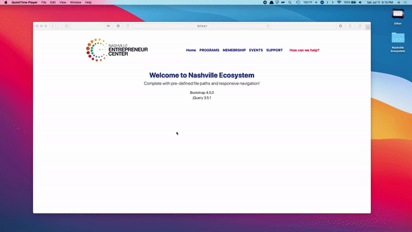

# NashvilleEC

# Demo

# GOAL
The goal is to create an ecosystem map, centralized database, and recommendation system for the Nashville Entrepreneurial center. This map will allow anyone to easily explore the local startup ecosystem, find out what resources are available, and determine which resources are the best fit for them. This site will touch hundreds of local organizations and has the potential to be seen and utilized by thousands of entrepreneurs. 

# How we built it
We built the web pages based on the design that we received from Nashville- EC team. The database is designed by using many to many relationship tables in MySql and PHP. The suggestion algorithm takes the parameters of the user's input from the form and outputs the names of the organization which matches more parameters of the user's input in decreasing order differentiated by each parameter in a different row. The ecosystem map has a filter system implemented where the users get a list of all the resources and can filter based on their requirements.

# What's next for this project
Nashville EC can use this website as their main website by adding the remaining fields and completing populating the database with all the resources.

# More info
More information on how it works can be found in the below youtube links. If you still don't find what you are looking for, please feel free to contact Lepakshi Agarwal @ agarwallepakshi@gmail.com or Sohil Jain @ sohil147@gmail.com

